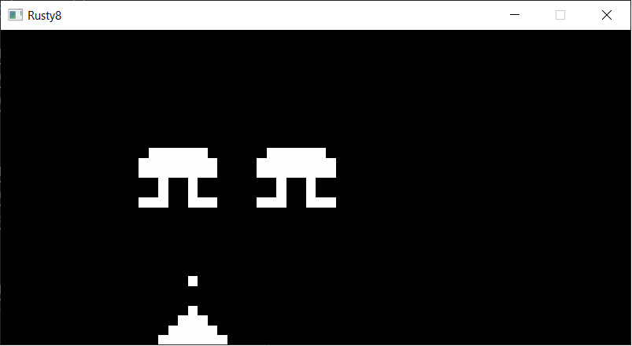
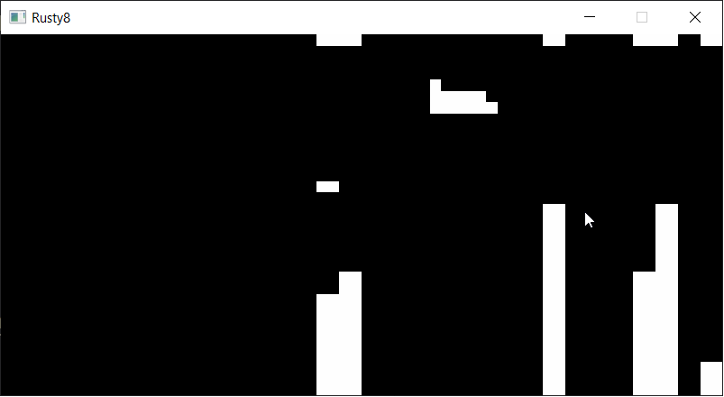
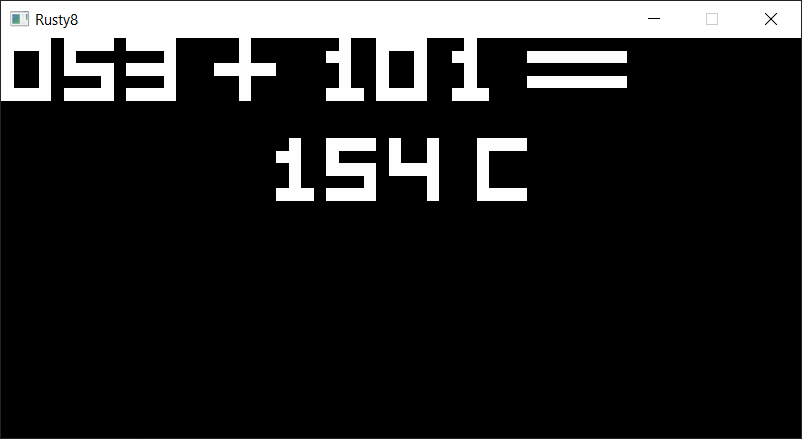

# Rusty8

[CHIP-8](https://en.wikipedia.org/wiki/CHIP-8) emulator written in Rust.

This was a side project to explore FLTK (as an alternative to SDL or GTK) and to get a glimpse at the experience of writing an emulator.
In retrospective, this might not have been what I was looking for.

## Screenshots

Invaders

Blitz

Addition problems

